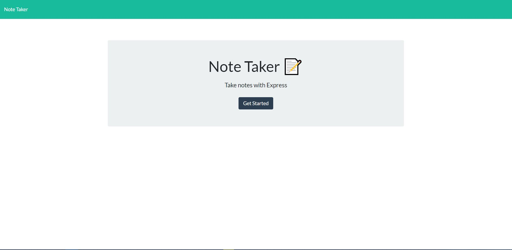
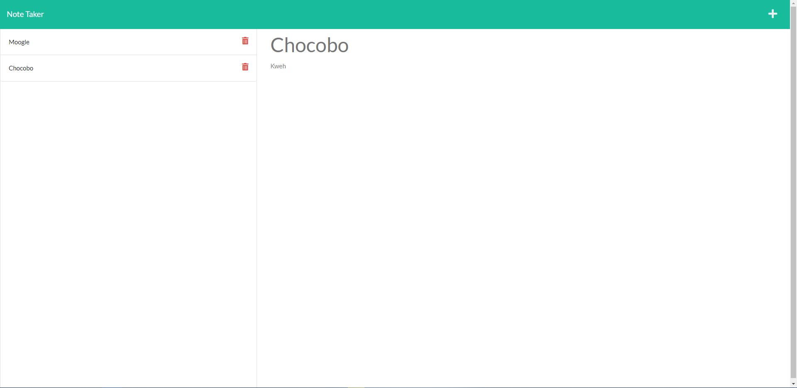

# Note Taker
  
  
  
  
  
  
  
 

  ## Description

  ----------------------

  This project uses Node.js and Express.js in order to set up a server that allows for persistent storage. Each note created will be saved to the server witha unique id, and can be deleted. 

  [Click Here](https://stark-springs-47350.herokuapp.com/) to visit the Heroku site for the application.

  
  

  
  
  

   
 ## License

  -----------------------

  MIT License 

  Copyright (c) [2022] by [John Yoder]

  [Click Here](https://choosealicense.com/licenses/mit/) to go to license details